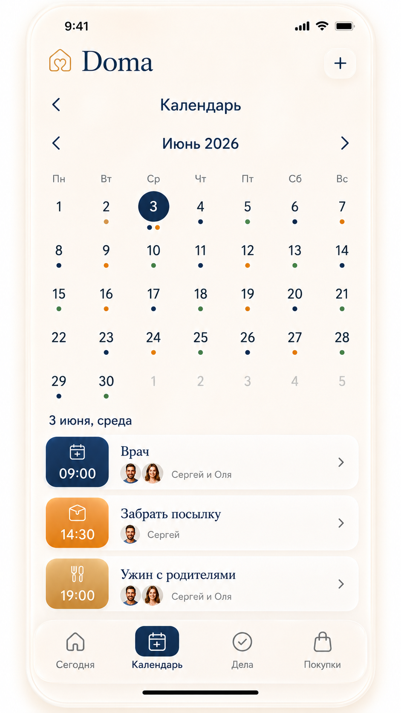
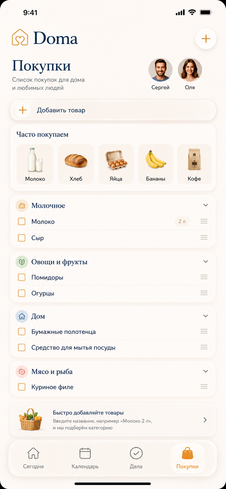

# Doma

[](https://github.com/sergeapollonov/doma/actions/workflows/ci.yml)
[](LICENSE)
[](tsconfig.json)
[](https://expo.dev)

Doma is an open-source, privacy-first family planning app built with Expo, React Native, and TypeScript.

It is designed as a calm shared plan for everyday home life: events, household tasks, shopping lists, reminders, and later offline sync. The project is also a public reference for building humane, multilingual, mobile-first applications with strong product documentation and a reusable design system.

## Why Doma Exists

Most planning tools are optimized for work, teams, or productivity systems. Doma is intentionally smaller and more personal:

- a shared view of what is happening at home today;
- fast creation of events, tasks, and shopping items;
- bilingual Russian and Polish interface patterns;
- privacy-first product decisions;
- iOS-first visual design with Android adaptation;
- documented screens, flows, data model, and design tokens.

The goal is not to clone a calendar or task manager. The goal is to make family coordination feel quiet, warm, and fast.

## Project Status

Doma is in early alpha.

Current state:

- Expo + React Native + TypeScript alpha prototype;
- static app screens backed by deterministic local mock data;
- reusable UI components in `src/components`;
- local Zustand store for events, tasks, shopping, selected date, and language;
- local add/complete/purchase flows for events, household tasks, and shopping items;
- React Hook Form + Zod validation for Login, Create Family, New Event, New Task, and New Shopping Item forms;
- design tokens in `src/theme`;
- bilingual RU/PL copy structure in `src/i18n`;
- product, design, flow, privacy, and data model documentation in `docs`;
- visual references in `design-references`;
- TypeScript check via `npm run typecheck`;
- unit tests via `npm test`;
- Expo web export verification via `npm run verify:web`.

Not implemented yet:

- real authentication;
- persistent local store;
- pending mutation queue;
- Supabase backend;
- realtime sync;
- push notifications;
- native widgets;
- production security hardening.

## Screenshots

The repository includes design references used to guide implementation.

| Welcome | Today | Calendar |
|---|---|---|
|  |  |  |

| Tasks | Shopping | New event |
|---|---|---|
|  |  |  |

## Tech Stack

- Expo
- React Native
- TypeScript
- React Native Web
- Expo Vector Icons
- Zustand
- React Hook Form
- Zod

Planned stack:

- i18next / react-i18next for localization;
- Supabase Auth, PostgreSQL, Realtime, and Storage;
- expo-notifications for reminders;
- date-fns for date handling.

## Getting Started

Requirements:

- Node.js 24 or newer;
- npm;
- Expo-compatible local environment.

Install dependencies:

```bash
npm install
```

Run the web preview:

```bash
npm run web
```

Run TypeScript checks:

```bash
npm run typecheck
```

Run unit tests:

```bash
npm test
```

Verify the Expo web export:

```bash
npm run verify:web
```

## Documentation

Start here:

- `docs/PROJECT-INDEX.md` - source-of-truth map;
- `docs/product-brief.md` - product goals and MVP scope;
- `docs/design-system.md` - visual language and tokens;
- `docs/screens.md` - screen specifications;
- `docs/user-flows.md` - core user flows;
- `docs/data-model.md` - planned data model;
- `docs/testing.md` - local and CI verification workflow;
- `docs/privacy-notes.md` - privacy principles;
- `docs/privacy-threat-model.md` - practical privacy risks and backend security gates;
- `docs/oss-roadmap.md` - public open-source roadmap.

## Open Source Roadmap

Doma is being prepared as a useful public project, not only a personal app.

Near-term OSS goals:

- reusable Expo app structure for privacy-first mobile apps;
- documented design system and screen patterns;
- bilingual localization architecture;
- local-first state management;
- accessible mobile UI components;
- security and privacy review process;
- issue templates and contribution paths for new contributors.

## Good First Contributions

Good starting areas:

- improve Polish localization coverage;
- audit remaining demo copy and localization terminology;
- add component-level tests;
- improve accessibility labels;
- document setup steps for iOS and Android;
- add usage notes for reusable UI components;
- improve privacy and security documentation.

See `docs/issue-drafts` for prepared issue ideas.

## How Codex Helps This Project

This project is intentionally structured so Codex can help maintain it in public:

- review pull requests for TypeScript, UI, and privacy risks;
- generate focused tests for new UI and state flows;
- refactor duplicated screen code into reusable components;
- draft release notes and changelogs;
- keep documentation in sync with implementation;
- triage issues into roadmap milestones;
- run security and privacy-oriented code reviews.

The repository is document-heavy by design, so agentic coding tools have enough context to make narrow, reviewable changes without inventing product direction.

## Contributing

Contributions are welcome once the project reaches the first public alpha milestone. Please read:

- `CONTRIBUTING.md`;
- `CODE_OF_CONDUCT.md`;
- `SECURITY.md`.

## Privacy

Doma is a family planning app, so privacy matters from the first commit.

Do not include real family data in issues, pull requests, screenshots, tests, logs, or example fixtures. Use the demo names and mock data already present in the project.

## License

MIT License. See `LICENSE`.
